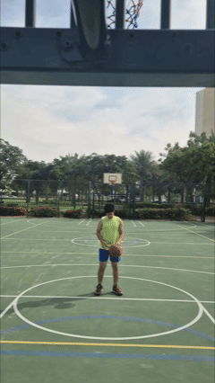
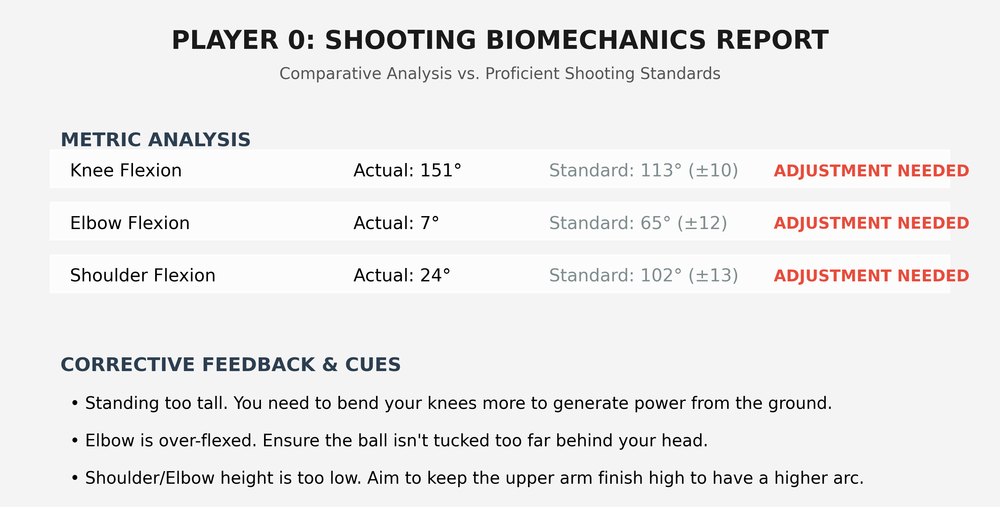

**🏀 AI Basketball Coach**

An advanced computer vision system designed to analyze basketball shooting mechanics, track ball trajectory, and provide biomechanical feedback using YOLO.

**📽️ Project Demo**

  
<i>Tracking ball trajectory and skeletal biomechanics during a shot (left). Report of Biomechanical Feedback (right).</i>

**🚀 Key Features**

High-Precision Detection: Utilizes YOLO26x for state-of-the-art object detection, ensuring consistent tracking of the basketball even at high velocities.

Advanced Pose Estimation: Integrated with YOLO26x-pose for ultra-accurate 2D skeletal landmarking, providing a more robust foundation for biomechanical analysis than standard models.

**⚙️ Installation & Setup**

1. Navigate to your working folder

'''bash
cd [replace this with the folder name]

2. Clone github repository

git clone [https://github.com/Mostafa-Elemam-re/AI-Basketball-Coach.git](https://github.com/Mostafa-Elemam-re/AI-Basketball-Coach.git)

cd AI-Basketball-Coach

3. Create & Activate Environment

python -m venv [replace this with the name of environment]

[name of environment]\Scripts\activate

pip install -r requirements.txt
